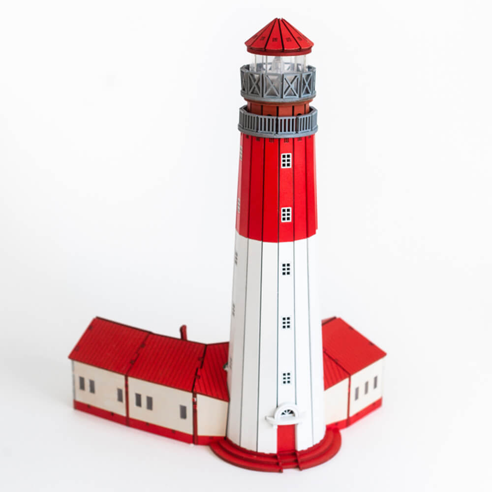

# Light.ino — Эффекты для ESP32

## История создания
Когда я купил себе модель маяка, мне она показалась очень скучной. Для красивого оформления я решил сделать такой проект.

## Описание
- Плавное перетекание между 12 светодиодами (аппаратный PWM)
- Эффект "свечи" для 3 светодиодов (случайное мерцание)

## Подключение
- Основные светодиоды: пины 27, 26, 25, 33, 32, 23, 22, 21, 19, 18, 17, 16
- "Свечи": пины 2, 4, 5

## Сборка
- Открыть Light.ino в Arduino IDE
- Выбрать плату ESP32 Dev Module
- Загрузить скетч

## Схемы и платы
- В папке `files/` находятся схемы и платы в формате PDF:
  - `Schematic_house_2025-04-26.pdf` — схема свечей
  - `PCB_PCB_house_2025-04-26.pdf` — плата свечей
  - `PCB.pdf` — плата (маяка)
  - `Schematic_Mayak.pdf` — схема маяка

## Производственные файлы
- В папке `production/` находятся файлы для заказа плат и компонентов:
  - `Gerber_house.zip` — герберы для изготовления платы свечей
  - `BOM_house.csv` — спецификация компонентов для свечей
  - `Gerber_Mayak-.zip` — герберы для изготовления платы маяка
  - `BOM_Mayak.csv` — спецификация компонентов для маяка

  При установке Светодиоды на маяке. Необходимо их загнуть на 90 градусов чтобы они светили параллельно платье маяка. 

## Зависимости
- Arduino core for ESP32 